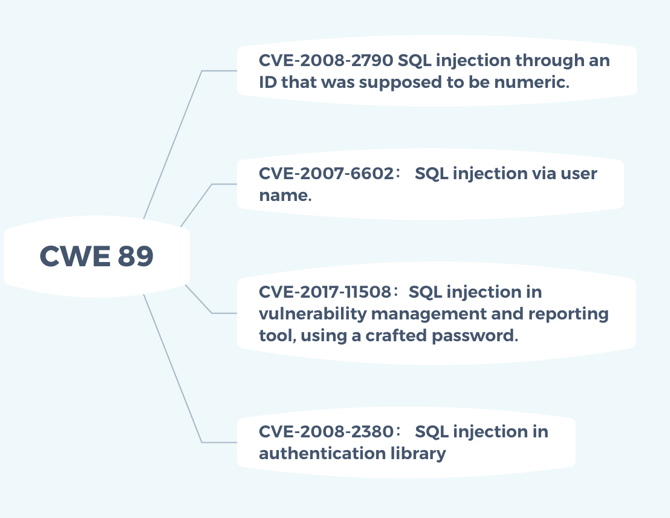
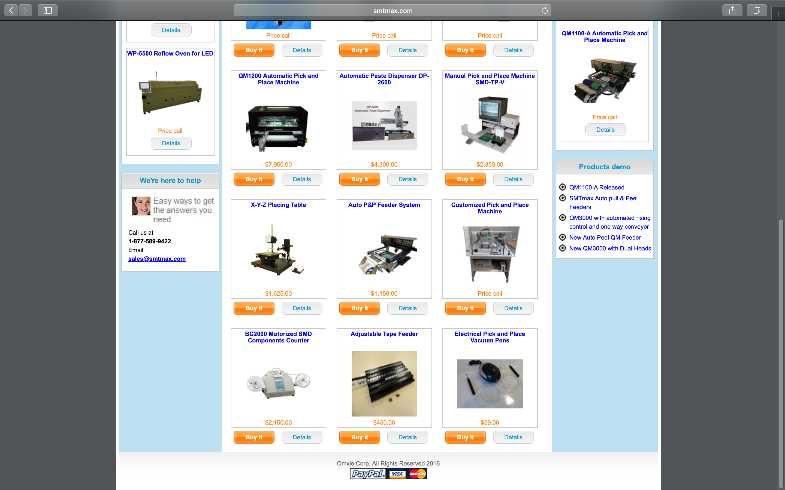
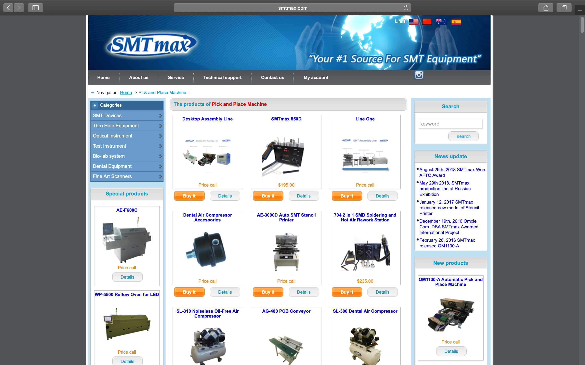
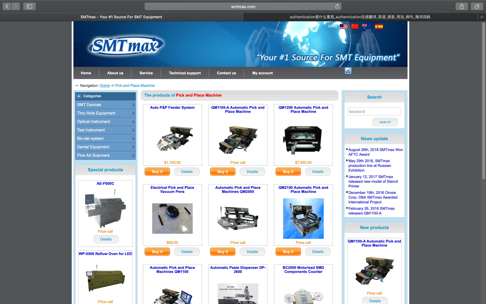
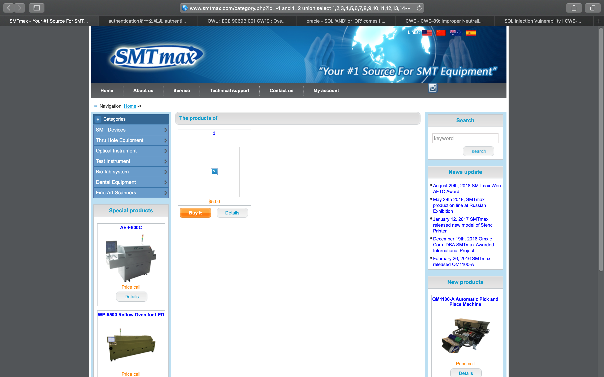
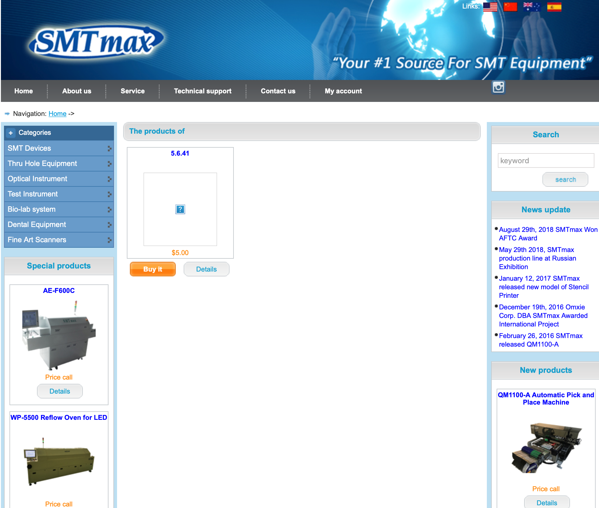

# CWE-89: Improper Neutralization of Special Elements used in an SQL Command ('SQL Injection')

SQL Injection has been a major source of cyber attacks as its status as top in the list of Top 25 most dangerous software errors.

## Description

The software constructs all or part of an SQL command using externally-influenced input from an upstream component, but it does not sanitize or incorrectly sanitizes special elements that could modify the intended SQL command when it is sent to a downstream component.

Without sufficient removal or quoting of SQL syntax in user-controllable inputs, the generated SQL query can cause those inputs to be interpreted as SQL instead of ordinary user data. This can be used to alter query logic to bypass security checks, or to insert additional statements that modify the back-end database, possibly including execution of system commands.

## Mode of Introduction

The different Modes of Introduction provide information about how and when this weakness may be introduced. The Phase identifies a point in the software life cycle at which introduction may occur, while the Note provides a typical scenario related to introduction during the given phase.

| Phase | Note |
| ------ | ------ |
| Architecture and Design | This weakness typically appears in data-rich applications that save user inputs in a database. |
| Implementation | REALIZATION: This weakness is caused during implementation of an architectural security tactic. |

## Common Consequences
The table below specifies different individual consequences associated with the weakness. The Scope identifies the application security area that is violated, while the Impact describes the negative technical impact that arises if an adversary succeeds in exploiting this weakness.

| Scope           | Impact                                                       |
| --------------- | ------------------------------------------------------------ |
| Confidentiality | Since SQL databases generally hold sensitive data, loss of confidentiality is a frequent problem with SQL injection vulnerabilities. |
| Authentication  | If poor SQL commands are used to check user names and passwords, it may be possible to connect to a system as another user with no previous knowledge of the password. |
| Authorization   | If authorization information is held in a SQL database, it may be possible to change this information through the successful exploitation of a SQL injection vulnerability. |
| Integrity       | Just as it may be possible to read sensitive information, it is also possible to make changes or even delete this information with a SQL injection attack. |

Through this list of common consequences, it can be seen that the impact of a breach can result in total compromise of an application susceptible to it. 

## Relation with CVE




The examples that are observed over the years have been placed into the CVE. Some of these examples are given on the [NVD](https://nvd.nist.gov/vuln/search/results?form_type=Advanced&results_type=overview&search_type=all&cwe_id=CWE-89). It has around 5000 entries in this category.

## Attack Patterns
An attacker exploits this weakness in software that constructs SQL commands based on user input. According to CAPEC classification there are the following attack patterns:

- CAPEC-7: [Blind SQL Injection](http://capec.mitre.org/data/definitions/7.html)
- CAPEC-66: [SQL Injection](http://capec.mitre.org/data/definitions/66.html)
- CAPEC-108: [Command Line Execution through SQL Injection](http://capec.mitre.org/data/definitions/108.html)
- CAPEC-109: [Object Relational Mapping Injection](http://capec.mitre.org/data/definitions/109.html)
- CAPEC-110: [SQL Injection through SOAP Parameter Tampering](http://capec.mitre.org/data/definitions/110.html)
- CAPEC-470: [Expanding Control over the Operating System from the Database](http://capec.mitre.org/data/definitions/470.html)

## Demonstrative Examples

### Example 1

The following code dynamically constructs and executes a SQL query that searches for items matching a specified name. The query restricts the items displayed to those where owner matches the user name of the currently-authenticated user.

```c#
...
string userName = ctx.getAuthenticatedUserName();
string query = "SELECT * FROM items WHERE owner = '" + userName + "' AND itemname = '" + ItemName.Text + "'";
sda = new SqlDataAdapter(query, conn);
DataTable dt = new DataTable();
sda.Fill(dt);
...
```

The query that this code intends to execute follows:

```sql
SELECT * FROM items WHERE owner = <userName> AND itemname = <itemName>;
```

However, because the query is constructed dynamically by concatenating a constant base query string and a user input string, the query only behaves correctly if itemName does not contain a single-quote character. If an attacker with the user name wiley enters the string:

```
name' OR 'a'='a
```

for itemName, then the query becomes the following:

```sql
SELECT * FROM items WHERE owner = 'wiley' AND itemname = 'name' OR 'a'='a';
```

The addition of the:

```
OR 'a'='a
```

condition causes the WHERE clause to always evaluate to true, so the query becomes logically equivalent to the much simpler query:

```sql
SELECT * FROM items;
```

This simplification of the query allows the attacker to bypass the requirement that the query only return items owned by the authenticated user; the query now returns all entries stored in the items table, regardless of their specified owner.

### Example 2

MS SQL has a built in function that enables shell command execution. An SQL injection in such a context could be disastrous. For example, a query of the form:

```sql
SELECT ITEM,PRICE FROM PRODUCT WHERE ITEM_CATEGORY='$user_input' ORDER BY PRICE
```

Where $user_input is taken from an untrusted source.

If the user provides the string:

```
'; exec master..xp_cmdshell 'dir' --
```

The query will take the following form:

```sql
SELECT ITEM,PRICE FROM PRODUCT WHERE ITEM_CATEGORY=''; exec master..xp_cmdshell 'dir' --' ORDER BY PRICE
```

Now, this query can be broken down into:

1. a first SQL query: SELECT ITEM,PRICE FROM PRODUCT WHERE ITEM_CATEGORY='';
2. a second SQL query, which executes the dir command in the shell: exec master..xp_cmdshell 'dir'
3. an MS SQL comment: --' ORDER BY PRICE

As can be seen, the malicious input changes the semantics of the query into a query, a shell command execution and a comment.

### Example 3

This code intends to print a message summary given the message ID.

```php
$id = $_COOKIE["mid"];
mysql_query("SELECT MessageID, Subject FROM messages WHERE MessageID = '$id'");
```

The programmer may have skipped any input validation on $id under the assumption that attackers cannot modify the cookie. However, this is easy to do with custom client code or even in the web browser.

While $id is wrapped in single quotes in the call to mysql_query(), an attacker could simply change the incoming mid cookie to:

```
1432' or '1' = '1
```

This would produce the resulting query:

```sql
SELECT MessageID, Subject FROM messages WHERE MessageID = '1432' or '1' = '1'
```

Not only will this retrieve message number 1432, it will retrieve all other messages.

In this case, the programmer could apply a simple modification to the code to eliminate the SQL injection:

```php
$id = intval($_COOKIE["mid"]);
mysql_query("SELECT MessageID, Subject FROM messages WHERE MessageID = '$id'");
```

However, if this code is intended to support multiple users with different message boxes, the code might also need an access control check ([CWE-285](https://cwe.mitre.org/data/definitions/285.html)) to ensure that the application user has the permission to see that message.

## Potential Mitigation

SQL injection has been a problem security researchers and developers are trying to resolve from a couple of decades already. There are tools that targets it specifically. Let us have a look at them one by one.

### Phase: Architecture and Design

#### 1. Strategy: Libraries or Frameworks

In this strategy, one of the ways to mitigate the SQL injection is at the Architecture and Design phase by using the libraries or frameworks which either does not allow the weakness to occur or provide some constructors that makes the weakness easier to avoid.

#### 2. Strategy: Parametrization

The usage of structured mechanisms that automatically separates the data from the code, and are able to provide the relevant quoting, encoding, and validation automatically. This reduces the reliance on the developer to provide this capability where ever an output is produced.

#### 3. Strategy: Environment Hardening

There are some suggestions for environment hardening so that the code is executed at the lowest possible privilege required to accomplish the necessary task. Some of these suggestions are as follows:

- Creation of isolated accounts, if possible, with limited privileges that are only used for a single task. 
- Adherence to the least privilege criteria when creating user account to an SQL database. 
- Usage of the strictest permissions possible on all database objects, such as execute-only for stored procedure.

#### 4. Strategy: Repetition of client-side security checks onto the server

The security checks performed on the client-side should be duplicated on the server so that the attacker will not be able to bypass these security checks on client side and feed in malicious values to the server.

#### 5. Strategy: Enforcement by Conversion

The cases where the set of acceptable values are known, for example files or URLs, then the maps with a fixed number of indices should be used and the rest are prohibited.

### Phase: Implementation

#### 1. Strategy: Output Encoding

To address those cases where the dynamically generated queries, which although risky but becomes a requirement, the suggestion is to ensuring that the arguments are quoted and the special characters are escaped.

#### 2. Strategy: Input Validation

Assume all input is malicious. Use an "accept known good" input validation strategy. Reject any input that does not strictly conform to specifications, or transform it into something that does. Do not rely exclusively on looking for malicious or malformed inputs.

When performing input validation, consider all potentially relevant properties, including length, type of input, the full range of acceptable values, missing or extra inputs, syntax, consistency across related fields, and conformance to business rules.

When constructing SQL query strings, use stringent whitelists that limit the character set based on the expected value of the parameter in the request.

#### 3. Strategy: Properly handle error messages

Error messages have the minimal amount of information. The error messages are to strike a balance between being too cryptic and not being cryptic enough. They should not reveal the process used to generate the error message.

### Phase: Operations

#### 1. Strategy: Environment Hardening

The environment should be properly configured to only give the lowest level of privileges to the users and to avoid the usage of the features that are too malicious to use.

#### 2. Strategy: Application Firewall

Application firewall for the environment where the application may not be controlled for SQL injection like in the case of the third party applications. It should be noted that this as an emergency remediation with moderate effectiveness.

## Demo

### Step 1

Enter the target website URL as shown below. We append a single quote (‘) at the end of the URL. If it is vulnerable to attach, then a message will be displayed on screen e.g. “You have an error in your SQL syntax; check the manual that corresponds to your MySQL server version for the right syntax to use near ''' at line 1”. This error means this site is vulnerable and we can perform further injections on it.




### Step 2

Enter the syntax, “or 1 = 1” which makes the “where” clause always equal to TRUE.
Hence, we will be able to get the whole list of items from the table. 




### Step 3

Utilizing the **order by n--** to find out the number of columns available in the current table. We can incrementally try the n value to find that value out.




### Step 4

Also, we can use the union command such as **<URL with negative id value>and<false condition><union select 1,2,3,4,5,6,7,8,9,10,11,12,13,14-- >**. Some numbers will be displayed on screen which can be used in further steps.




### Step 5

Find out the version **version(),** in place of the number i.e. “3” in the URL and the remaining URL is typed same as above. In this example, database version is displayed as “**5.6.41**”.




### Step 6

Similarly, name of the database can be find out by adding the **database(),** in place of **3** in the above steps. In this case, the following will be shown.


## Reference

[Official page](<https://cwe.mitre.org/data/definitions/89.html>)

[CWE-89 by Lucideus](https://blog.lucideus.com/2018/06/an-introduction-to-cwe-89-improper.html)

[Introduction by high tech bridge](https://www.htbridge.com/vulnerability/sql-injection.html#software)

[CWE-89 by Security Database](https://www.security-database.com/cwe.php?name=CWE-89)

[A case study of SQL injection attack](http://www.ijesrt.com/issues%20pdf%20file/Archive-2016/July-2016/23.pdf)